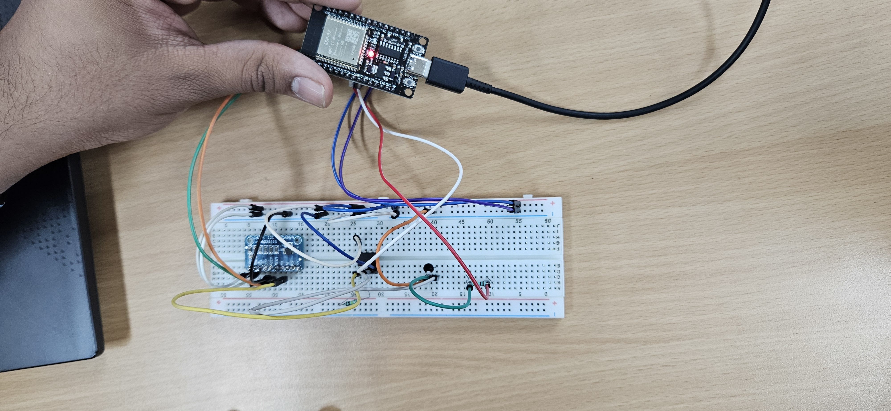
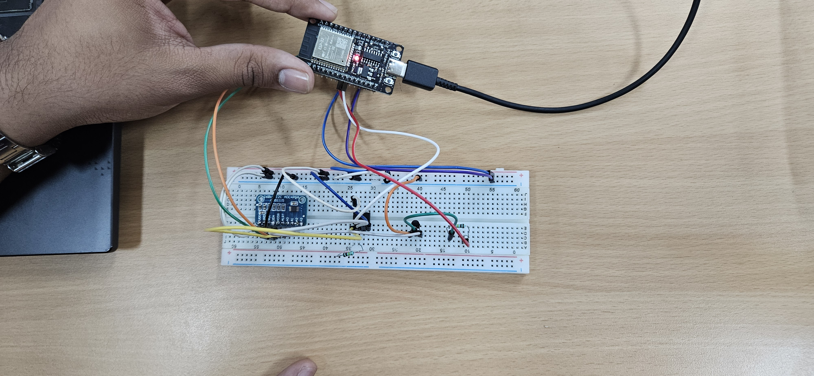

# BJT / MOSFET Characteristics Plotter

An ESP32-based system that automatically plots the I-V characteristics of BJT and MOSFET transistors, replacing manual point-by-point lab measurements.

---

## 📌 About the Project

In standard electronics labs, plotting transistor characteristics (like CE output characteristics for BJT or drain characteristics for MOSFET) requires manually setting voltages and recording currents one point at a time — a slow and error-prone process.

This project automates that entire process using an ESP32 microcontroller. The ESP32 sweeps the input voltage across a defined range, reads the corresponding output current via ADC, and transmits the data for real-time curve plotting on a PC.

Built as a team project during the 2nd year of B.Tech (ECE) at NSUT, Delhi.

---

## ⚙️ Hardware Used

- ESP32 microcontroller
- BJT transistor (NPN)
- MOSFET
- DAC/ADC module (for voltage sweep and current sensing)
- Breadboard + jumper wires
- USB connection to PC (for serial data transfer and plotting)

---

## 🛠️ How It Works

1. ESP32 generates a stepped voltage sweep using DAC output
2. For each voltage step, the ADC reads the output current (via a sense resistor)
3. Data pairs (V, I) are sent over serial to a PC
4. The PC plots the I-V curve in real time

---

## 📸 Hardware Setup

| View 1 | View 2 |
|--------|--------|
|  |  |

> ESP32 connected to breadboard with transistor circuit and ADC module

## 📈 Output Plots

| BJT Characteristics | MOSFET Characteristics |
|---------------------|------------------------|
|  |  |

---

## 🧰 Tools & Technologies

| Tool | Purpose |
|------|---------|
| ESP32 | Microcontroller for voltage sweep and ADC reading |
| Arduino IDE | Firmware development (C++) |
| Serial Monitor / Python | Real-time data plotting |

---

## 👥 Team

Developed as a team project — B.Tech 2nd Year, ECE, NSUT Delhi (2026)

---

## 📄 License

This project is open for educational use.
